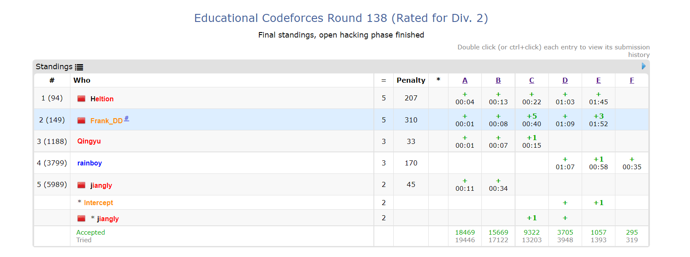

# 总结

今天VP了[Educational Codeforces Round 138](https://codeforces.com/contest/1749)，挺不在状态。

还做了Codeforces1750E [Bracket Cost](https://codeforces.com/problemset/problem/1750/E)

# 部分题解

## Codeforces 1749E  [Cactus Wall](https://codeforces.com/problemset/problem/1749/E)

### 题意

一个$n\cdot m$的地图，初始一些地方是'#'，要求填尽量少的'#'，使得不存在一条从第一行到第$n$行的路径不经过'#'，且任意两个'#'不相邻。构造方案或判断无解。

### 题解

'#'不能相邻那么显然就是斜着走，相当于找一条从第$1$列到第$m$列的满足不相邻限制的最短路。我写了Dij，但是因为边权为$0$或$1$，可以BFS。复杂度$O(n\cdot m)$。

## Codeforces 1750E [Bracket Cost](https://codeforces.com/problemset/problem/1750/E)

### 题意

给出一个长度为$n$的括号串$s$，每次可以对一个子串进行shift操作，将$s[l,r]$变成$s[r],s[l,r-1]$，也可以在任意位置添加字符。问对于$s$的所有子串，将其变为合法括号序列的最小操作数的和。

### 题解

首先要观察到重要结论，设$a$为$s$的前缀和（'('为1，')'为-1），那么$s[l,r]$的最小操作数为$ \max{(a_{l-1},a_{r})}-\min \limits_{l-1 \le i \le r}{a_i}$。然后就可以分治去做，或者是把两部分分开算。复杂度$O(nlogn)$。
